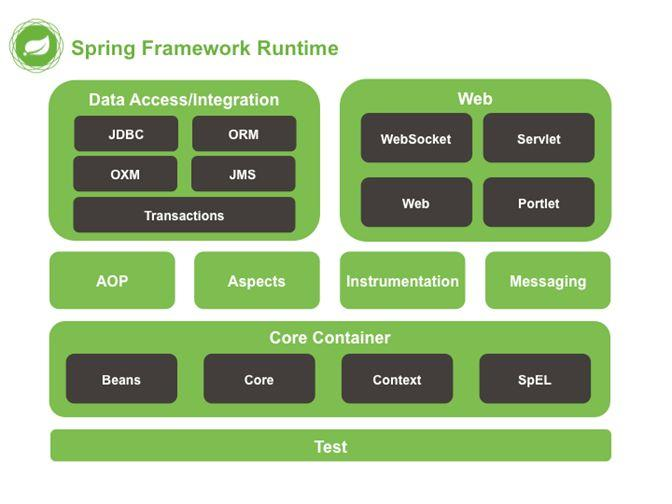
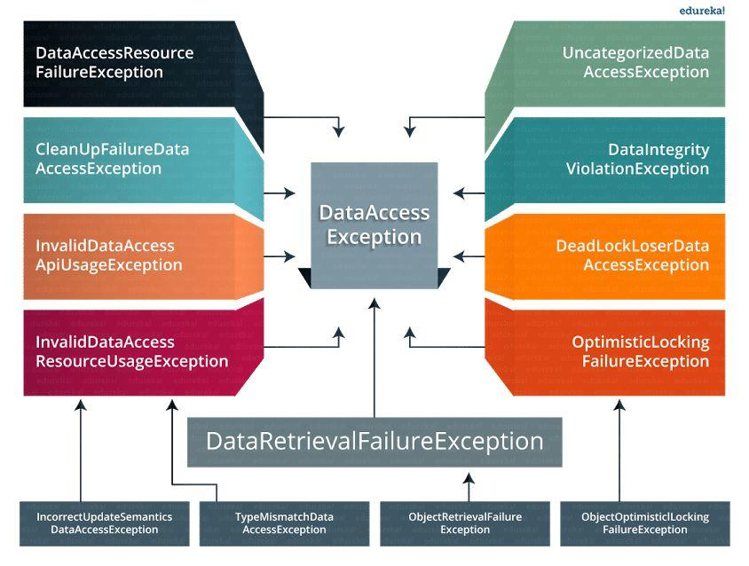

# Spring基础

## Spring概述

Spring是java企业级应用开发的开源框架，Spring主要用于开发Java应用，但是有些扩展是针对构建J2EE平台的web应用。 Spring框架目标是简化Java企业级应用开发，并通过以POJO为基础的编程编程模型促进良好的编程习惯。

## Spring的优点

* 轻量、体积小，基本版本约2M。
* 非侵入式：支持基于POJO的编程模式，不强制要求实现Spring框架中的接口或继承Spring框架中的类。
* IoC容器：利用IoC容器可以实现依赖注入，帮助应用程序管理对象与对象之间的依赖关系，若对象之间的依赖关系发生了改变 ，只需要改变配置文件而不需修改代码。程序员也不需要自己编写工厂、单例模式了，这一点符合Spring的精神“不要重复的发明轮子”。
* AOP：将所有的横切关注功能封装到了切面中，通过配置的方式将横切关注功能动态地添加到了目标代码上，进一步实现了业务逻辑和 系统服务的分离，另一方面，有了AOP程序员可以省去很多自己写代理类的工作。
* MVC：Spring的MVC框架是非常优秀的，从各个方面都优于Struts2，为WEB表示层提供了更好的解决方案。
* 事务管理：Spring可以接受多种持久层技术，并且为其提供了声明式的事务管理，在不需要任何一行代码的情况下就能够完成事务管理。
* 异常处理：Spring提供方便的API把具体技术相关的异常\(JDBC、Hibernate等抛出的\)转化为一致的unchecked异常。

## Spring的模块组成

1.Spring核心层

* Core module
* Bean module
* Context module
* Expression Language module

2.数据访问/集成层

* JDBC module
* ORM module
* OXM module
* Java Messaging Service\(JMS\) module
* Transaction module

3.Web层

* Web module
* web-Servlet module
* Web-Socket module
* Web-Portlet module

4.其他层

* AOP：该层支持面向切面编程
* Instrumentaion:该层为实现类检测和类加载器实现提供支持
* Test：该层为使用JUnit和TestNG进行测试提供支持
* Messaging：该模块为STOMP提供支持，它还支持注解编程模型，该模型用于WebSocket客户端路由和处理STOMP消息
* Aspects:该模块为与AspectJ的集成提供了支持

## 使用Spring的方式

* 作为一个成熟的Spring Web应用程序
* 作为第三方框架，使用Spring Frameworks中间层

## 完整的Spring应用程序应有的组件

* 接口：用于定义功能
* Bean类：它包含属性，setter和getter方法、其他方法等
* Spring AOP：提供面向切面编程的功能，用于服务于业务方法，完善应用程序
* Bean配置文件：包含类的信息及如何配置它们
* 用户程序：使用接口

## IoC的概念

IoC控制反转，又可以称为依赖注入。控制反转是把传统上由程序代码直接操控的对象的生成交给了容器来实现， 通过容器来实现对象组件的装配和管理。所谓“控制反转”就是组件对象控制权的转移，从程序代码本身转移到了外部容器， 由容器来创建并管理对象之间的关系。

## IoC的优点

* 能最小化应用程序中的代码量
* 它将使您的应用程序易于测试
* 它以最小的影响和最少的侵入机制促进松耦合
* 它支持即时的实例化和延迟加载服务

## Spring IoC容器

Spring 框架的核心就是Spring容器，由容器来创建对象，并将它们装配在一起，配置并管理它们的完整生命周期， Spring容器使用依赖注入来管理组成应用程序的组件。容器通过读取提供的配置元数据\(该元数据可以通过XML、Java注解或Java代码提供。\)来接受对象进行实例化，配置和组装的命令。


Spring IoC的实现原理：工厂模式加反射机制


### 种类

1. BeanFactory：就像一个包含bean集合的工厂类，它会在客户端要求时实例化bean
2. ApplicationContext：ApplicationContext接口扩展了BeanFactory接口，它在BeanFactory基础上提供了一些额外的功能

#### 区别

* BeanFactory使用懒加载，ApplicationContext使用即时加载
* BeanFactory使用语法显式提供资源对象，ApplicationContext自己创建和管理对象
* BeanFactory不支持国际化，ApplicationContext支持国际化
* BeanFactory不支持基于依赖的注解，ApplicationContext支持基于依赖的注解

## Spring里的依赖注入

在依赖注入中，你不必创建对象，但必须描述如何创建它们，不是直接在代码中将组件和服务连接在一起，而是描述配置文件中有哪些组件需要服务，由IoC容器将它们装配在一起。

### 依赖注入的方式

1. 构造函数注入
2. setter注入
3. 接口注入


在Spring Framework中，仅使用构造函数注入和setter注入


### 构造函数注入和setter注入的区别

* 构造函数注入没有部分注入、setter注入有部分注入
* 构造函数注入不会覆盖setter属性，setter注入会覆盖setter属性
* 构造函数注入，任意修改都会创建一个新实例。setter注入，任意修改不会创建一个新实例
* 构造函数注入适用于设置很多的属性，setter注入适用于设置少量属性

## Spring Bean

它们是构成用户应用程序主干的对象，由Spring IoC容器基于用户提供给容器的配置元数据进实例化、配置、装配和管理的。

### 配置Spring Bean

1. 基于XML配置
2. 基于注解配置：在相关的类、方法或字段声明上使用注解，将bean配置为组件类本身，需要开启注解装配
3. 基于Java API的配置：通过使用@Bean和@Configuration注解完成


当Spring Bean基于XML配置时，此XML文件称为**Spring配置文件**，该文件主要包含类信息，它描述了这些类是如何配置以及相互依赖的。


### Spring Bean的作用域

Spring bean支持5种scope

1. Singleton：每一个Spring IoC容器中仅存在一个单实例bean
2. Prototype：每次从容器中请求调用bean时，都会返回一个新的实例
3. Request：每次Http请求都会创建一个新的bean
4. Session：同一个HttpSession共享同一个bean，不同的HttpSession使用不同的bean
5. GlobalSession：同一个全局Session共享一个bean


仅当用户使用支持Web的ApplicationContext时，最后3个才可用。


### Spring bean的生命周期

1. Spring IoC容器找到关于bean的定义并实例化该bean
2. Spring IoC容器对bean进行依赖注入
3. 如果bean实现了BeanNameAware接口，则将该bean的id传给setBeanName\(\)方法
4. 如果bean实现了BeanFactoryAware接口，则将BeanFactory对象传给setBeanFactory\(\)方法
5. 如果bean实现了BeanPostProcessor接口，则调用其postProcessBeforeInitialization\(\)方法
6. 如果bean实现了InitializingBean接口，则调用其afterPropertySet方法
7. 如果有何bean管理的BeanPostProcessor对象，则这些对象的postProcessAfterInitialization\(\)方法被调用
8. 当销毁bean实例时，如果bean实现了DisposableBean接口，则调用其destory\(\)方法

### Spring内部bean

bean作为另一个bean的属性时，可以将该bean声明为内部bean，内部bean配置位于&lt;property&gt;里。

### Spring装配

当bean在Spring容器中组合在一起时，它被称为装配或bean装配。Spring容器需要知道是什么bean以及容器该如何使用依赖注入来将bean绑定在一起，同时装配bean。

#### 自动装配

通过检查BeanFactory的内容让Spring自动解析bean的协作者。自动装配的方式：

1. no：这是默认设置，表示没有自动装配。应使用显式bean引用进行装配
2. byName：它根据bean的名称注入对象依赖项。它匹配并装配其属性与XML文件中相同名称定义的bean
3. byType：它根据类型注入对象依赖项。如果属性的类型与XML文件中的一个bean名称匹配，则匹配并装配属性
4. 构造函数：它通过调用类的构造函数来注入依赖项。它有大量的参数
5. autodetect：首先容器尝试通过构造函数使用autowire装配，如果不能，则尝试通过byType自动装配

**自动装配的局限：**

* 可能会覆盖：您始终可以使用&lt;constructor-arg&gt;和&lt;property&gt;设置指定依赖项，这将覆盖自动装配。
* 基本数据类型无法自动装配
* 自动装配可能不太精确

## Spring 注解

### 基于注解的容器配置

不使用XML来描述bean装配，开发人员通过在相关的类、方法或字段声明上使用注解 将配置移动到组件类，作为XML设置的替代方案。

### 启动注解装配

配置&lt;context:annotion-config/&gt;元素在Spring配置文件中启用它。

### @Component,@Controller,@Repository,@Service的区别

这几个注解是用来标注需要由Spring IoC容器进行对象托管的类。这几个注解并没有本质区别。

* @Component用于普通的类，将该类标记为bean。Spring的组件扫描机制可以将其拉入到应用程序中。
* @Controller用于将一个类标记为Spring Web MVC控制器。标有它的Bean会自动导入到IoC容器中。
* @Service用于业务逻辑类
* @Repository用于仓储类\(例如我们的DAO实现类\)，它将该类导入到IoC容器，并使为经检查的异常有资格装换为Spring DataAccessException

### @Required注解

@Required应用于bean属性setter方法。此注解仅指示必须在配置时使用bean定义中的显式属性值或使用自动装配填充受影响的bean属性， 如果尚未填充受影响的bean属性，则容器将抛出BeanInitializationException。

### @Autowired注解

@Autowired可以更准确地控制应该在何处以及如何进行自动装配，此注解用于在setter方法，构造函数，具有任意名称或 多个参数的属性或方法上自动装配bean。默认情况下，它是类型驱动的注入。

### @Qualifier注解

当您创建多个相同类型的bean并希望仅使用属性装配其中一个bean时，您可以使用@Qualifier注解和@Autowired通过指定应该装配哪个确切的bean来消除歧义。

### @RequestMapping

@RequestMapping注解用于将特定HTTP请求方法映射到将处理相应请求的控制器中的特定类/方法。此注释可应用于两个级别： 

* 类级别：映射请求的URL
* 方法级别：映射URL以及HTTP请求方法

## 数据访问

### Spring支持的ORM框架

* Hibernate
* myBatis
* JPA\(Java Persistence API\):java持久化规范，为了简化现有的持久化开发工作和整合ORM技术。 Spring Data JPA是Spring基于ORM框架、JPA规范的基础上封装的一套JPA应用框架，可以使开发者用简单的代码即可实现 对数据的访问和操作。

### Spring Data JPA 与Mybatis的对比

Spring Data JPA是Spring Data的子模块。Spring Data JPA的目标是大大简化了数据访问层代码的编码，作为使用者，我们只需编写自己的repository接口，接口中包含一些个性化的查询方法，Spring Data JPA将自动实现查询方法。 JPA默认使用Hibernate作为ORM实现，所以一般使用Spring Data JPA即会使用Hibernate。两者的对比也可以看成是Hibernate和MyBatis的对比。

#### Hibernate

Hibernate是一个开放源代码的对象关系映射框架，它对JDBC进行了非常轻量级的对象封装，它将POJO与数据库表建立映射关系，是一个全自动的ORM框架，Hibernate可以自动生成SQL语句，自动执行，使得程序可以自由地使用对象编程思维来操作数据库。

#### MyBatis

MyBatis是一款优秀的持久层框架，它支持定制化SQL、存储过程以及高级映射。MyBatis避免了几乎所有的JDBC代码和手动设置参数以及获取结果集。MyBatis可以使用简单的XML或注解来配置和映射原生信息，将接口和Java的POJO映射成数据库中的记录。

#### 对比

Hibernate是一个自动化更强、更高级的框架，因为在Java代码层次面上，省去了绝大部分的SQL编写，取而代之的是用面向对象的方式操作关系型数据库的数据。而MyBatis则是一个能够灵活编写SQL语句，并将SQL的参数和查询结果映射成POJOs的一个持久层框架。所以Hibernate的自动化更强，而MyBatis在SQL语句编写方面则更灵活自由。

### Spring DAO\(数据访问模块\)作用

Spring DAO使得JDBC，Hibernate或MyBatis这样的数据访问技术更容易以一种统一的方式工作。这使得用户容易在持久性技术之间进行切换。它还允许你在编写代码时，无需考虑捕获每种技术的不同异常。

### Spring DAO抛出异常

### Spring JDBC API中的类

* JdbcTemplate
* SimpleJDBCTemplate
* NamedParameterJdbcTemplate
* SimpleJdbcInsert
* SimpleJDBCCall

### Spring中的事务管理

**编程式事务管理**、**声明式事务管理**。许多Spring框架的用户选择声明式事务管理，因为这种方式和应用程序的关联较少，因此更加符合轻量级容器的概念， 所以声明式事务管理要优于编程式事务管理，尽管在灵活性方面它弱于编程式事务管理，因为编程式事务允许你通过代码控制业务。

